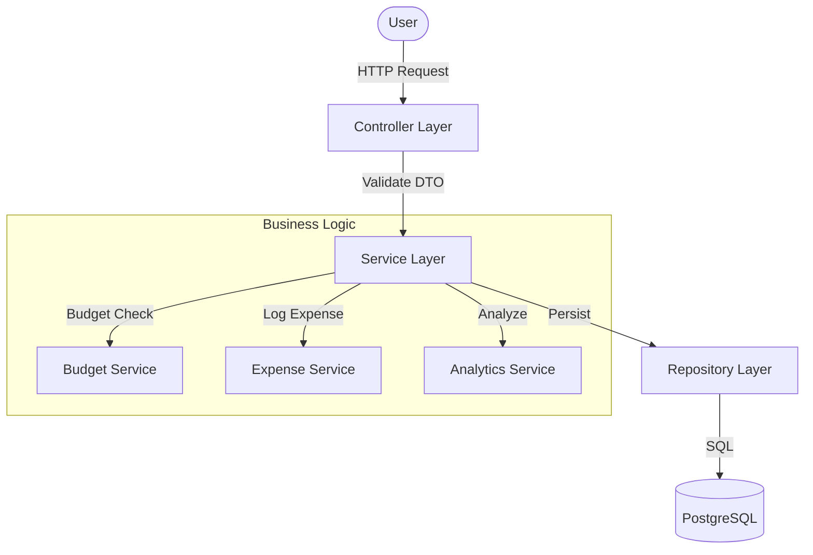
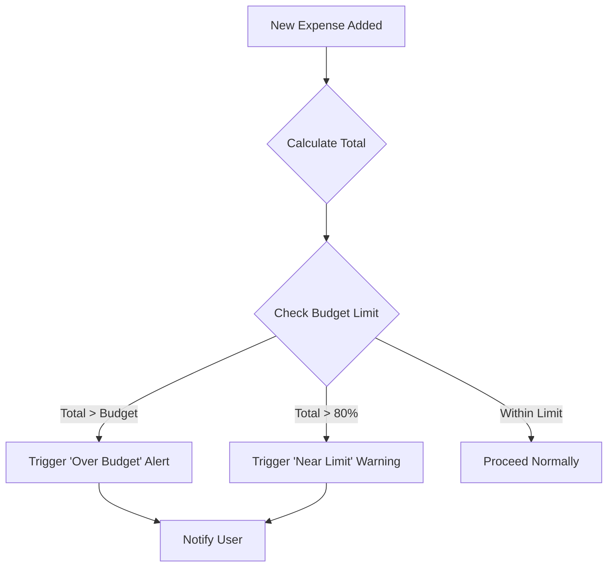
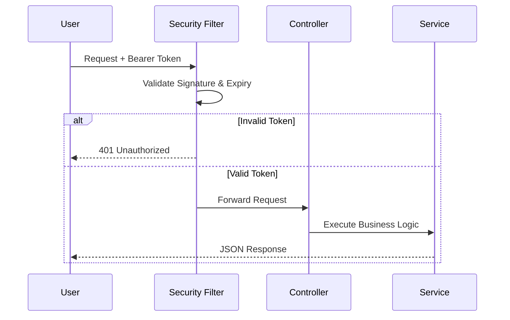
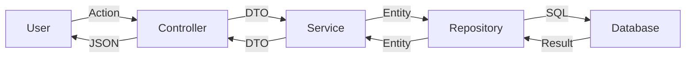

# 💰 Smart Expense Tracker

**Take control of your finances without the headache.**

Welcome to the **Smart Expense Tracker**! This isn't just another digital ledger—it's a tool designed to help you actually understand your spending habits. Whether you're saving for a dream vacation, paying off debt, or just tired of wondering where your paycheck went, this tracker is here to give you clarity and confidence.

We built this with a focus on simplicity, security, and actionable insights. Let's make financial freedom a reality, one entry at a time.

---

## ✨ Features You'll Love

*   **🔒 Secure & Private**: Your financial data is yours. We use robust JWT authentication to ensure your information stays safe.
*   **⚡ Effortless Logging**: Track expenses in seconds. Categorize them to see exactly where your money is going (Food? Entertainment? That subscription you forgot about?).
*   **🎯 Goal-Getter Budgets**: Set realistic budgets for different categories. We'll help you stay on track with smart alerts before you overspend.
*   **📊 Visual Insights**: Ditch the spreadsheets. Our analytics dashboard turns your numbers into clear, easy-to-read charts so you can spot trends instantly.
*   **📅 Daily Tracking**: Get a clear view of your daily spending patterns.

---

## 🛠️ Tech Stack

Built with modern, reliable technologies:

*   **Java 21**: Leveraging the latest Java features for performance and stability.
*   **Spring Boot 3.5.9**: The powerhouse framework driving our backend.
*   **PostgreSQL**: A robust, production-grade database for your data.
*   **Spring Security & JWT**: Industry-standard security for peace of mind.
*   **Spring Data JPA**: Seamless data management.
*   **Lombok**: Keeping our code clean and concise.

---

## 🚀 Getting Started

Ready to run this locally? Follow these simple steps:

### Prerequisites
Make sure you have these installed:
*   [JDK 21](https://www.oracle.com/java/technologies/downloads/#java21)
*   [Maven](https://maven.apache.org/download.cgi)
*   [PostgreSQL](https://www.postgresql.org/download/)

### Installation

1.  **Clone the valid repo:**
    ```bash
    git clone https://github.com/satyajitsatvaya/Smart_Expense_Tracker.git
    cd ExpenseTracker
    ```

2.  **Configure the Database:**
    *   Create a PostgreSQL database named `expense_tracker`.
    *   Open `src/main/resources/application.properties` and update your database credentials:
        ```properties
        spring.datasource.url=jdbc:postgresql://localhost:5432/expense_tracker
        spring.datasource.username=your_username
        spring.datasource.password=your_password
        ```

3.  **Run the Application:**
    ```bash
    mvn spring-boot:run
    ```
    The server will start on port `8080`.

---

## 🏗️ Backend Engineering & Architecture

I designed the Smart Expense Tracker with scalability, maintainability, and clean code principles in mind. Here's a look under the hood.

### 1. Backend Architecture

The application follows a robust **Layered Architecture**, ensuring separation of concerns and modularity.



*   **Controller Layer**: The entry point for all HTTP requests. It handles input validation, maps requests to the appropriate service methods, and returns structured JSON responses. We use DTOs here to decouple the internal domain model from the external API contract.
*   **Service Layer**: The heart of the application. This layer contains all business logic, including budget calculations, alert triggers, and transaction processing. It is transactional, ensuring data integrity across operations.
*   **Repository Layer**: Handles data access and persistence. We leverage Spring Data JPA to interact with the PostgreSQL database efficiently, using distinct interface-based repositories for each entity.
*   **Analytics Layer**: A specialized component within the service layer responsible for aggregating data. It performs complex calculations (e.g., monthly spending, category breakdowns) to drive the dashboard insights.
*   **Security Layer**: Responsible for authentication and authorization. It intercepts every request to validate JWT tokens and sets the security context for the current thread.
*   **Database Layer**: PostgreSQL serves as the persistent storage, strictly enforcing referential integrity and data types.

### 2. Smart Alert Engine

The **Smart Alert Engine** is a proactive system designed to keep users financially healthy. It doesn't just record data; it monitors it in real-time.



*   **Logic**: Every time an expense is added or updated, the engine evaluates the current spending against the set budget for that category.
*   **Warning System**: If spending exceeds **80%** of the allocated budget, a warning flag is triggered, notifying the user they are nearing their limit.
*   **Breach Detection**: If the expense pushes the total beyond 100% of the budget, an "Over Budget" alert is generated immediately.
*   **Implementation**: This logic is encapsulated within the `BudgetService`, ensuring that no expense goes unchecked.

### 3. Analytics Engine

Data without context is noise. The **Analytics Engine** transforms raw transaction data into actionable insights effectively.

*   **Aggregations**: Instead of fetching all records and processing them in memory (which is slow), we use optimized JPQL and native SQL queries to perform aggregations directly at the database level.
*   **Capabilities**:
    *   **Monthly Trends**: Calculates total spending per month to show financial velocity.
    *   **Category Breakdown**: Groups expenses by category to highlight high-spending areas.
    *   **Budget vs. Actual**: Computes the percentage of budget utilized for every category in real-time.

### 4. Security Architecture

Security is not an afterthought; it is baked into the core. We rely on a **Stateless JWT (JSON Web Token)** architecture.



*   **Flow**:
    1.  User logs in with credentials.
    2.  Server validates credentials and issues a signed JWT.
    3.  Client attaches this JWT to the `Authorization` header (`Bearer <token>`) for subsequent requests.
    4.  **Spring Security Filter Chain** intercepts the request, validates the token signature, extracts user details, and explicitly authenticates the session for that specific request.
*   **Why Stateless?**: By not storing session data on the server, the application is ready for horizontal scaling (cloud-native ready). REST APIs are stateless by definition, and JWT aligns perfectly with this principle.

### 5. Key Backend Engineering Concepts

*   **DTO Pattern**: We strictly use Data Transfer Objects (DTOs) for API payloads. This prevents exposing internal database entities (like `User` or `Expense`) directly to the client, preventing over-fetching and security vulnerabilities.
*   **Repository Pattern**: detailed abstraction over data access. We never write raw JDBC code; Spring Data JPA handles the heavy lifting while allowing custom queries when performance dictates.
*   **Global Exception Handling**: A centralized `@ControllerAdvice` catches exceptions across the application, returning uniform, user-friendly error responses instead of raw stack traces.
*   **Transactional Integrity**: Critical operations (like creating an expense that updates a budget) are wrapped in `@Transactional` to ensure atomicity.

### 6. System Design Overview

The high-level request flow is linear and predictable:



**User Request** (`POST /api/expenses`)
⬇
**Security Filter** (Validates JWT)
⬇
**Controller** (Validates Input DTO)
⬇
**Service** (Applies Business Logic & Alert Engine)
⬇
**Repository** (Persists Data)
⬇
**Database** (PostgreSQL Storage)

This unidirectional flow makes debugging straightforward and the system easy to extend.

---

## 🔌 API Quick Reference

Here are a few endpoints to get you started (check the code for full documentation):

*   **Auth**:
    *   `POST /api/auth/register` - Create a new account
    *   `POST /api/auth/login` - Log in and get your token
*   **Expenses**:
    *   `GET /api/expenses` - Get all your expenses
    *   `POST /api/expenses` - Add a new expense
*   **Budgets**:
    *   `POST /api/budget` - Set a budget category
    *   `GET /api/budget` - View your budget status

---

## 🔮 Future Roadmap: AI Integration

*   **🧠 Global AI Financial Coach**: Personalized, actionable advice on how to save money based on spending habits (e.g., "You spent 20% more on dining out this month; try cooking at home this week to save $50").
*   **🤖 Predictive Expense Categorization**: Leveraging NLP models to automatically predict and assign categories based on transaction descriptions (e.g., "Uber" → "Transport").
*   **📈 Smart Budget Forecasting**: Implementing time-series forecasting (ARIMA/Prophet) to predict next month's spending based on historical trends.
*   **📸 Receipt OCR Integration**: Building a pipeline to extract merchant, date, and total amount from receipt images automatically.
*   **🗣️ Voice-to-Expense Logging**: Natural Language Understanding (NLU) to parse spoken commands like "Spent $15 on lunch at Subway".

---

## 🤝 Contributing

Got an idea to make this better? Found a bug? Feature requests? I'd love your help!

1.  Fork the repository.
2.  Create a new branch (`git checkout -b feature/AmazingFeature`).
3.  Commit your changes (`git commit -m 'Add some AmazingFeature'`).
4.  Push to the branch (`git push origin feature/AmazingFeature`).
5.  Open a Pull Request.


